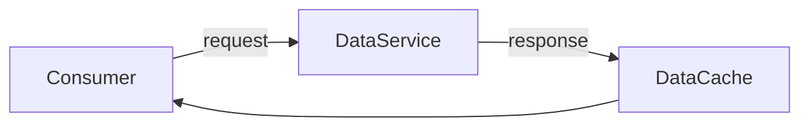

# What is caching ?

A cache is a data-storage component that can be accessed faster and more efficient than the original source of the data.

It is a temporary holding location for information

What if the data service has to perform complex operations in order to acquire the data ?
This complex operation can be resource intensive, time intensive, or both.

If the service has to perform the complex operation every time a consumer requests the data,
a significant amount of time and resources can be spent retrieving the same data over and over again.

Instead, with cache, the firt time the complex operation is performed, the result is returned to
the consumer, and copy of the results is stored in the cache.   
The next time the data is needed, the result can be pulled directly out of the cache and returned
to the consummer faster using fewer resources.

## Caching use cases

### HTTP application cache
When you access a web page, depending on the website, the page may require a fair amount of
processing in order for the page to be created, sent back to you, and rendered in your browser.
However, the page or signinificant portions of the page may not change much from one request to
the next.

A cache is used to store pages and/or protions of pages so they can be returend to a user faster
and using fewer resrouces than if the cache was not used.

An HTTP application cache

Web caching at various locatin:
- Browser cache
- Network cache
- Application cache

### HTTP network cache

When a web page is accessed by a user, the site generateing the page may be far away.
Sometimes in another part of the country.
It can take long time for the page to be sent from the website server to your browser.

HTTP protocols provide the capability to store copies of certain static web pages or page element
at intermedate locations along the route between the browser and the website server.

This is often the case for static content such as pictures, images and videos.

### Web browser cache

Yoru web browser itself may also cache some content so that it can be displayed almost instantly
rather waiting for it to be downloaded.

This browser cache is effective for images and other static content.

### Service cache

Services can have intermal caches to assist in performing complex and time-comsuming operations.

### API cache

When one service calls another uisng an API, the resonse to the API call can be stored in a cache and used to return results for equivalent future calls.

### Database cache

Request data from the database can be expensive. Database caches can be used in several location
within databases to speed up queries.

### CPU cache

### Memory cache

RAM is fast, but not fast enough for CPUs.

### Disk cache

## What does a cache need to be useful ?

In order for a cache to work and provide value, the following must be true:
1. The operation to caculate or retrieve teh requesed data must be slow, require expensive resources.
2. The cache must be able to store and retrieve the result faster using fewer resource.
3. Data that doesn't change from request request to request is easier to use in caching situations.
4. The operation to calculate or retrive the requested data must have no side effects.
It doesn't store data, doesn't make cahnges to other systems, doesn't control other software or hardware.
5. The data must be need more than one. The more times it is need, the more effective and use full the cache is.

Fore a cache to be effective, you need a good understanding of the statistical distribution of the
data access from your application or data source.

## Static vs dynamic caches

### Static cache aka **read/only**

When a value is stored in the cache, it cannot be changed by the application. It is immutable.
Changes to teh data into data store, and the out-of-date values are removed from the cache.
The next tiem the value is accessed from the cache, it will be missing, and it will be read from
the data store and the new value will stored in the cache.

### Dynamic cache aka **read/write**

When a value is changed in the data store, the value is also changed directly in the cache,
an old value is overwritten with a new value.