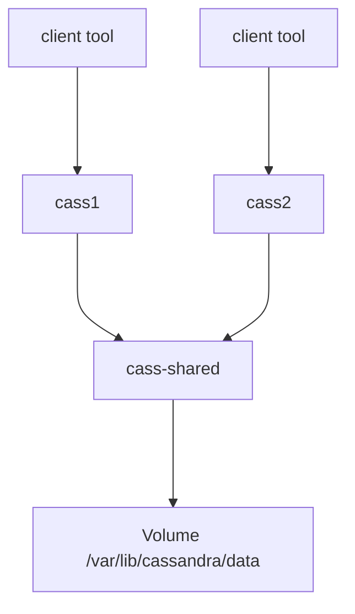

# Persistent storage and shared state with volumes

In the real workd programs work with data.

When you run a database inside a container.

You package the software with the image, and when you start the container, it is empty database.

When programs connect to the database and enter data, where is that data stored ?
- It is in a file insde the container ?
- What happens to that data when you stop te container or remove it ?
- How would you move your data if you wanted to upgrade the database program ?

You run a web application that write logs, logs will outlive the container?
- How to access those logs ?
- How can other programs such as log digest tools get access to those files?

# 4.1 Introducing volumes

A container's directory tree is created by a set of mount points.

A volume is a mount point on the container's directory tree.

Volumes provide container-independent data management.

That makes volumes an important part of any containerized system design taht shares or writes files.

- Database software vs database data
- Web application vs log data
- Data processing application vs input/output data
- Web server vs static content
- Products vs support tools

Volumes enable separation of concerns and create modularity for an architectural.

Images are appropriate for packaging and distributing static files.

Volumes hold dynamic data or specialization.

## 4.1.2 Using volumes with a NoSQL

Task: Use Cassandra image to create a single-note, create a keyspace, delete the container and then recover that keyspace

1. Create a container that has a volume.

```sh
docker run -d \
    --volume /var/lib/cassandra/data \
    --name cass-shared \
    alpine echo Data Container
```

2. Create a container and use the volume is in other container.

```sh
docker run -d --volumes-from cass-shared --name cass1 cassandra:2.2
```

3. Start client tool container

```sh
docker run -it --rm --link cass1:cass cassandra:2.2 cqlsh cass
```

Query the keyspace:

```sql
select * from system.schema_keyspaces where keyspace_name = 'docker_hello_world';
```

Create the keyspace:

```sql
create keyspace docker_hello_world
with replication = {
    'class' : 'SimpleStrategy',
    'replication_factor': 1
};
```

4. Remove the cass1 container.

```sh
docker rm -rf cass1
```

If the modifications you made are persisted, the only place they could remain is the volume container.
If that is true, then the scope of data has expanded to include two container, and its life cycle has extend beyond the container
where the data originated.



# 4.2 Volume types

There are 2 types:
- bind mount
- managed volume

Every volume is a mount point on the **container** tree to a location on the **host** tree.

Bind mount volumes: use any user-specified dir or file on the host OS.

Managed volumes use locations that are created by the Docker daemon in space controled by the daemon a.k.a Docker managed space.

## 4.2.1 Bind mount volumes

Useful when:
- The host provides some file or directory that needs to be mounted into the container directory tree at specific point.
- Share data with other processes running outside a container.

For example, you want to share a document or web page on your local computer with a friend.

Solution 1: Create a image with the shared document then run, but it is cumbersome to update the rebuild the image every time you update documents.

Solution 2: Lauch a web server and bind mount the localtion into the container.

```sh
docker run -d --name bmweb -v ~/example-docs:/usr/local/apache2/htdocs -p 80:80 httpd:latest
```

Use the `-v` flag to mount.

The software can write back to the mount point in the host so it may contain vulnerabilities.
Docker provides a protect as read-only with `:ro`

```sh
docker run -d --name bmweb -v ~/example-docs:/usr/local/apache2/htdocs:ro -p 80:80 httpd:latest
```

Quick test

```sh
docker run --rm -v ~/example-docs:/testspace:ro alpine /bin/sh -c 'echo foo > /testspace/foo.txt'
```

You can bind a indiviudal file, to keep other files, avoding lost files because you bind a directory.

The big problem is conflict with other containers. It would be bad to start mulitple instances of cassandra that all use the same
host location as volume. 

## 4.2.2 Docker-managed volumes

Using managed volumes is a method of decoupling volumes from specialized location on the file system.

Use `-v` option but only specify the mount point in the container directory tree.

When you run:

```sh
docker run -d -v /var/lib/cassandra/data --name cass-shared alpine
```

Docker does:
1. Docker daemon creates directory in somewhere in a part of the host file system. 

Use `docker inspect` you see

```json
"Mounts": [
            {
                "Type": "volume",
                "Name": "5d68bba0f511b18fe5eb669fb1fbef01e662bcebbe85903af4e5f36ae1ea5461",
                "Source": "/var/lib/docker/volumes/5d68bba0f511b18fe5eb669fb1fbef01e662bcebbe85903af4e5f36ae1ea5461/_data",
                "Destination": "/var/lib/cassandra/data",
                "Driver": "local",
                "Mode": "",
                "RW": true,
                "Propagation": ""
            }
        ],
```

# 4.3 Sharing volumes

You have a web server running inside a container that logs all the requests it receives to `/logs/access`.

## 4.3.1 Host-dependent sharing

Tow or more containers are said to use host-independet sharing when each has a bind mount volume for a single known location on the file
system.

```sh
mkdir ~/web-logs-example

docker run --name plath -d -v ~/web-logs-example:/data dockerinaction/ch4_writer_a

docker run --rm -v ~/web-logs-example:/reader-data alpine:latest head /reader-data/logA

cat ~/web-logs-example/logA

```

## 4.3.2 Generalized sharing and the volumes-from flag

The flag `--volumes-from` can be set multiple times to specify multiple source containers.


```sh
docker run --name fowler \
    -v ~/example-books:/library/PoEAA \
    -v /library/DSL \
    alpine:latest \
    echo "Fowler collection created."

docker run --name knuth \
    -v /library/TAoCP.vol1 \
    -v /library/TAoCP.vol2 \
    -v /library/TAoCP.vol3 \
    -v /library/TAoCP.vol4.a \
    alpine:latest \
echo "Knuth collection created"

docker run --name reader \
    --volumes-from fowler \
    --volumes-from knuth \
    alpine:latest ls -l /library
```

Create an aggregation and use

```sh
docker run --name aggregator \
    --volumes-from fowler \
    --volumes-from knuth \
    alpine:latest

docker run --rm \
    --volumes-from aggregator \
    alpine:latest ls -l /library
```

# 4.4 The managed volume life cycle

## 4.4.1 Volume ownership

Define a single container for each managed volume:
- know extract volumes
- delete specific volumes

## 4.2.2 Clean up volumes

Docker can't delete bind mount volumes.

Docker can delete managed volumes with `-v` flags.

# 4.5 Advanced container patterns with volumes

## 4.5.1 Volume container pattern

Use `vc_` prefix name would be great hint for humans

`docker run --name vc_web ...`

> Problem:
> Contaier vc_data has /app and /logs volumes
> Container web-a uses vc_data's volume and uses /app
> Container web-b uses vc_data's volume and uses /app and /logs
> 2 containers confilic when using same volumes

### 4.5.2 Data-packed volume

```sh
# copy image content into a volume
docker run --name dpvc -v /config dockerinaction/ch4_packed /bin/sh -c 'cp /packed/* /config/'
```

config files + volume container patter

### 4.5.3 Polymorphic container pattern

A polymorphic container is one that provides some functionality that's substituted using volume.

Example: an image contains binaries for Node.JS and runs /app/app.js.
You can change the behavior of the container by injecting your own app.js.

```sh
docker run --name devConfig -v /config ...

docker run --name prodConfig -v /config ...

docker run --name devApp --volumes-from devConfig ...

docker run --name prodConfig --volumes-from prodConfig ...
```
