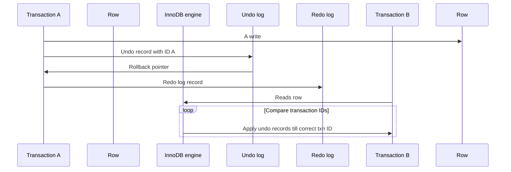

# Multiversion Concurrency Control

Most transactional storage engiens don't use a simple row-locking mechanishm.
They use row-level locing in conjunction with a technique for increase concurrency: multiversion concrurency control (MVCC).

MySQL, Orcle, PostgreSQL use MVCC.

MVCC avoids the need for locking at all in may cases and have lower overhead.
Depend how it is implemented, it allows nonlocking reads whiel locking only the necessary rows during
write operations.

Transaciton can see a consistent view of the data, no matter hwo long they run.
Different transactions can see differetn data in the same tables at the same time.

MVCC is implemented by the storage engine.

How InnoDB implements MVCC:
1. Assigns a transaction ID for reach transaction that starts
2. When a record is modified within that transaction, an undo record that explains how to revert that
change is writeen to the undo log and the rollback pointer of transaction is pointed at the undo log record.
3. 

TODO: read this [Get a deeper understanding of records structure in InnoDB](https://blog.jcole.us/2013/01/10/the-physical-structure-of-records-in-innodb/) 

When a diferetn session reads a cluster key index record, InnoDB compares the record's transaction ID
versus the read view of that session.

If 