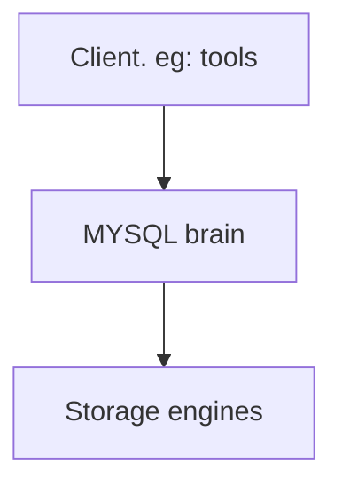

# Mysql's logical architecture

First layer: client, servces aren't unique to MYSQL(server tools, servers, netword-based client).

Second layer: MYSQL brain, query parsing, analysis, optimization and build-in
function, functionlity provided accroess sotrage engine: procedures, trigges, and views

Third layer: storage engines, like the systems, each storage has its own 
benefits and drawbacks.

## Connection Management and Security

Defaut, each client gets its own thread in the server process.
Queries in connections execute within that single thread, which in turn resides on one core or CPU.
Servier maitains a cache threads, dont' need to be created and destroyed
for each new connection.

When clients connect to MYSQL server:
1. The server authenticate (username, password ...)
2. The server verifies client ahs privileges (whether the client is allowed to iusse a `SELECT` on the table `Country`).

## Optimization and Execution

MYSQL parse queries to create an internal structure(the parse tree)
and apply optimizations.

Variety of optimizations:
- Rewriting the query
- Determinning the order, read table, use indexes.

## Concurrency Control

Any time more than one query needs to change data at the same time, the problem of concurrency control arises.

MySQL has to do this two levels:
- The server level
- The storage-engine level

## Illustrate how MySQL handles concurrent work.   
A spreadsheet (rows, cols), only you access, no issues. Now team members try to edit, add, remove cell. Many issues.
We can say that they should take turns making changes, but that is not efficient. Need an approach for allowing concurrent access.

## Read/Write Locks

Reading from the spread sheet isn't troublesome. Nothing wrong with multiple clients reading the same file.
Because they aren't making changes.

What happen if someone tries to delete cell A25 while other are reading the spreadsheet. A reader could come await
with a corrupted or inconsistent view. So even reading from a spreadsheet requires special care.

The solution is rather simple. Systems that deal with concurrent read/write access implement a locking system.
That consists of two lock types:
- Shared locks (read locks)
- Exclusive locks (write locks)

Read locks on resource are shared, many clietns can read from a resource at the same time without causing problems or changing
each other's results.

Write locks are exclusive, they block both read locks and other write locks. Safe policy is to have single client writing,
prevent all reads when a client is writing.

## Lock Granularity

One way to improve the concurrency of a shared resource is to be selective about what lock.

Lock entire resource ❌
Lock only what the part contains data you need to change ✅
Better lock extarct piece of data plant to change ✅✅

Mimimizing the amoutn of data that you lock, inrease chances get the resource simultaneously, don't conflict with others.

Lock is not free, every time you use lock, you must
1. Is a lock free
2. Release a lock

That may cause lock management perf > storing data perf.

You must find the lock stratergy (lock overhead and data safety). The lock strategies affect performance.

Most conmmercial database servers: you have row-level locking.

Expert operator database  would to configure to optimize the trade-off speed vs data safety.

## Two most important lock strategies

### Table locks

- The most basic locking strategy in MySQL
- Lowest overhead.

Lock entire the table, when client want to insert, delete, update, etc, it acquires a write lock.
When nobody is writing, readers can obtain read locks

Table lock have variations for improved perf.   
Example:
The `READ LOCAL` table locks allow some types of write operations.
Write lock queue and read lock queue. Write lock queue has higher priority.

### Row locks

- Greatest concurrency
- Greatest overhead

Allow multiple clients edit the table. More concurrent writes.
More overhead to keep: who has each row lock, how long they have been open, what kind of row lock, cleaning.

Row locks are implemented in the storage engine, not the server.