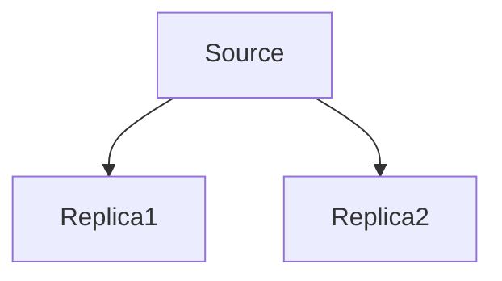

# Replication

MySQL is designed for accepting writes on one node at any time.
MySQL offers a native way to distrubte writes that one node takes to additional ndoes.
A.K.A replication.

The source ndoe has a thread per replica, that is replicaton client.

In productin, you should use replication and have at least 3 more replcias.
In cloude-hosted env, knowns as regions for disaster-recovery planning.