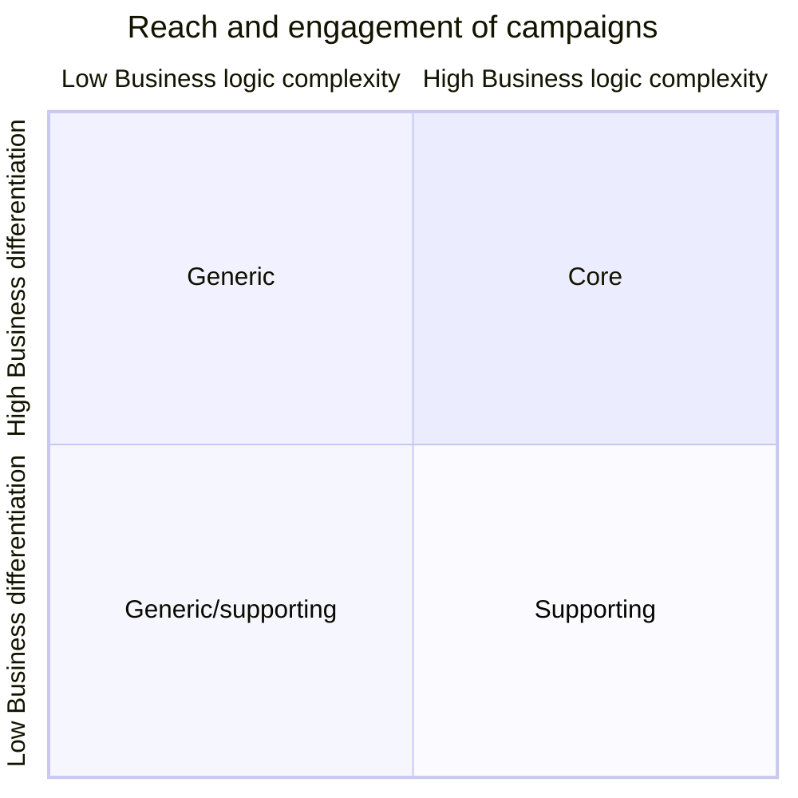

# Chapter 1. Analyzing Business Domains

# What is a Business Domain?

A business domain defiens a company's main area of activity.
I's the servcie the company provides to its clients.
- FedEx provides delivery
- Starbucks is best known for its coffee.

A company can operate in multipel domains.
For example, Amazon provides both retail and cloud computing services.

# What is a subdomain?

All of company's subdomains form its business domain.

## Type of subdomains

-DDD distinguishes between three types of subdomains: core, generic, supporting.

### Core subdomains

a core subdomain is what a company does differetnly from its competitors.
TODO: read and take note

### Generic subdomains

Generic subdomains are business activities that all companies are performing
in the same way.

Generic subdomaisn are generally complex and hard to implement.

Generid subdomain do not provide any competive edge for the company.

No need for innovration or optimzation.

For example: most systems need to authenticate and authorize.
Instead of inventing a authentication mechanism, it makes more sense to use an
existing solution.

A jewelry maker selling its product online:
- Jewelry design is a **core subdomain**.
- The online shop is a **generic subdomain**. 

### Supporting subdomains

Supporting domains support the company's business.
Supporting domains do not provide any competitive advantage.

##  Comparing Subdomains

Lets' explore their differences from additonal angles and see how they affect strategic 
software design decisions.

### Competive advantage

Only core suddomains provide a comptetitive advantage to a company.

the more complex the problems a company is able to tacke, teh more business value it can provide.
The complex problems are not limited to delivering services to customers.

### Complexitity

From a more technical perspective, it's important to idnetiyf the organization's subdomaons.
because the diffrent types types of subdomaisn have different levels of complexity.
When desigining software, we have to choose tools and techniques that accommodate the 
complexity of the business requirements. Therefore, identifying subdomains is essential
for designing a sound software solution.

Supporting suddomains's business logic is simple.
These are basic ETL operations and CRUD interfaces.
Often, it doens't beyond validateing inputs or convering data from one structure to another.

Generic subdomains are much more complicated.
There should be a good reason why ohters have already invested time and effort in solving 
these problems.
Consider, for example, encryption algorithms or authentication mechanisms.

You can either use best practices or if needed hire a consultant specializing in the area to 
help design a customer solution.

Core subdomaisn are complex. They shoudl be as hard for competitors to copy as possible.
The company's profitabiblity depsnds on it.

Ask question: Would someone pay for it on its own ?
If so, this is a core subdomain.

Would it be simpler and cheaper to hack your own implementatin, rather tan integrating an
external one ?
If so, this is a suporting subdomains.

From a more techincal perspective, it's importnt to identify the core subdomaisn whose
complexitity will affect software design.

Another usefull guiding priciple for identifying software-related core subdomaisn 
is not to evaluate the complexity of the business logic that you will have to model
and implement in code.

Does the business logic reseamble CRUD interfaces for data entry, or do you have to implement
complext algorithms or business processes orchestrated by complex business rules and
invariants.
In the former case, ti's a sign of a supporting subdomain, while the latter is a typical core subdomain.

## Volatility

Core subdomains can change often. The changes come in the form of adding new features or optimizing existing functionality.

Constrary to the core subdomaisn, supporting subdomaisn do not change often.

Despite having existing solutions, generic subdomain can change over time.
The changes can come in the form of security patches, bux fixes, or entirely new solutioons to the generic problems.

## Soltuion strategy

Core subdomains have to be implemented in-house.

## Identifying subdomain boundaries

The subdomains and their types are defined by the company's strategy

## Distilling subdomains

Coarse-grained subdomains are a godo starting point, but th edevil is in the details.
We have to make sure we are not missing important information hidden in th eintricacies of the business function.

Let's go back to the example of the customer service department.
If we investigate its inner workings, we will see that a typical customer service department is composed of 
finer-grained components, such as a help desk system, shift management and scheduling, telephone system and so on.

When viewed as individual subodmains, these activies can be of different types:
- while help desk and telephone systems are generic subdomains.
- while a company may develop its ingenious algorithm form routing incidents to agents having success wiht similar cases in the past.

The routing algorithum requires analyzing incomeing cases and identifying similarities in experiences, both of wich 
are not nontrivial tasks. Since the routing algorithm allows the company to provide a better customer experience
than its competitors, the routing algorithm is a core subdomain.

Customer service (Generic)
|_ Case routing (Core)
|_ Help desk system (Generic)
|_ Telephony (Generic)
|_ Shif management (Supporing)

### Subdomains are coherent use cases

From a technical perspective, subdomains resemble sets of interrelated, coherent use cases.
Such sets of use cases usually invoke the same actor, the business entities, and they all manipulate a closely related set of data.

The use cases are tightly bound by the data that they are working with and the involved actors.

We can use the definition of "subdomains as a set of coherent use cases" as a guiding priciple for when to stop
looking for finer-grained subdomains.
There are the most precise boundaries of the subdomains.

Core subdomains are the most important, volatile and complex.

If drilling down further doens't unveil any new insights that can help you make a sfotware design decisions,
it can be a good place to stop.

For example, further distillation of the help desk system subdomains is less usefull, as it doens't reveal any strategic information.

Help desk system (Generic)
- Ticket lifecycle (Generic)
- Search (Generic)
- Knowledge base (Generic)
- Alert system (Generic)

## Domain Analysis Examples

Let's see how we can apply the notion of subdomains in practice and use it for marking a number of strategic
design decisions.

fictitious: invented and not true or not existing
- Characters in this novel are entirely fictitious.
- He registered at the hotel under a fictious name.

Try to identify three the types of subdomaisn for each company.

### Gismater

Gigmaster is a ticket sales and distribution company.
Its mobile app analyzes user's music libraries, streaming service accounts, and social media profiles
to identify nearby shows that its users would be interested.

#### Business domain and subdomain

The business domain is ticket sales.

Core subdomains:
- The main competive advantage is recommendation engine.
- User's privarcy
- Mobile app's UX is crucial 

Generic subdomains:
- Encryption for encryping all data
- Accoutning
- Clearing, for charging its customer 
- Authentication, authorization

Supporting subdomains:
- ETL, CRUD
- Integration with music streaming services
- Integration with social networks
- Attended-gigs moduels

Design decisions
- The recommendation engine, data anonymization and mobile app have to be implemented in-house.
  These modules are going to change the most often.

- Off-the-shelf or open source solutions should be used for data encryption, accounting, clearing, and authentication.
off-the-shelf: the avaiable stuffs on the market

- Integration with streaming services, can be outsourced.

### BusVNext

BustVNext is a public transportation company.

