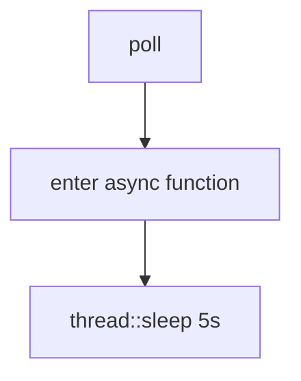

## Yielding control to the runtime

Rust gives a runtime a chance to pause the task and switch to another one if the future being
awaited isn't ready.

Explain this in an interview:
> Rust only pauses async blocks and hands control back to a runtime at an await point.
> Everything between await points is synchronous.

A:
In Rust, async is baed on **cooperative scheduling**, not **preemptive scheduling**.

An `async fn` is compiled by the compiler into a state machine implementing the `Future` trait.
The future only yields control back to the executor at executor at explicit `.await` point.

So:
```rs
async fn work() {
    step1();
    io_operation().await;
    step2();
}
```

Everyting before `.await` runs synchronously on the current thread.

At `.await`, the future may return `Poll::Pending`.
Which tell the runtime: "I'm not readly yet, you can schedule another task."

Later, the executor polls the future again and execution resumes from the saved state.

`.await' is not like spawning a thread. It's more like registeing a continuation in state machine.

## Why this design matters (cooperative scheduling)
- zero-cost async abstractions
- no hidden scheduler interruptions
- predictable control flow
- memory safety without a garabage collector

But it also means: Async Rust is only concurrent if tasks voluntarily yields.
So CPU-heavy work inside async code can starve the excutor if there are no `.await` points.

```rs
asycn fn bad() {
    loop {
        expensive_work();
    }
}
```

This monopolizes the executor thread because the task never yeilds.

Strong interview pharse:
Senior level answer:
> Rust async is stackless, poll-based cooperative multitasking. Futures only suspend at
explicit await points, which gives deterministic suspension behavior and avoids hidden
preemption costs. 

Q: What are preemption costs ?
A: In OS and concurrency, preemption means:
> The system forcibly interrupts a running taks so another task can run.
A preemption cost is the overhead caused by that interruption.

That switch is called a context switch. It has costs:
- Saving/restoring CPU states (registers, stack pointer, instruction pointer, CPU flags)

Q: Why do you should not use std::thread::sleep inside the async function ?
A: Using `std::thead::sleep` in the asnc fucntion is bad because it doesn't yield control back to the
executor. 

```rs
async fn bad() {
    std::thead::sleep(Duration::from_secs(5));
}
```
The executor thread is blocked for 5s.
During that time:
- no other async tasks can run on that worker thread
- the runtime cannot poll other futures
- concurents stalls (Other asysn task stop making progress because one task blocks the executor)

What actually happens:


Now the OS thead sleeps. The future never returns Poll::Pending or Poll::Ready.
So the executor is stuck waiting.

A: Correctio async version

```rs
async fn good() {
    tokio::time::sleep(Duration::from_secs(5)).await;
}
```
Now the flow becomes:

```
poll()
↓
register timer
↓
return Poll::Pending
↓
executor runs other task
↓
timer finishes
↓
executor polls future again
↓
got the Poll::Ready
```

Quality explaintion
`thread::sleep` blocks the underlying OS thread, while async runtimes expect futures to yield
cooperatively via `.await`. Since `thread::sleep` never returns `Poll::Pending`, the executor
cannot schedule other tasks on that worker thread.

```
worker thread 1 -> blocked 
worker thread 2 -> stil running
```

A good way to think about it:

async runtime:
    "I can switch task only when you let me."

thread::sleep:
    "No. Stay here for 5 seconds."

## Simulate a long-running operation to illustrate the starvation problem

```rs
fn slow(name: &str, ms: u64) {
    thread::sleep(Duration::from_millis(ms));
    println!("'{name}' ran for {ms}ms");
}
```

Real-world operations that are both long-running and blocking.
We use `slow` to emmulte doing this kind of CPU-bound work

```rs
let a = async {
    println!("'a' started.");
    slow("a", 30);
    slow("a", 10);
    slow("a", 20);
    trpl::sleep(Duration::from_millis(50)).await;
    println!("'a' finished.");
};

let b = async {
    println!("'b' started.");
    slow("b", 75);
    slow("b", 10);
    slow("b", 15);
    slow("b", 350);
    trpl::sleep(Duration::from_millis(50)).await;
    println!("'b' finished.");
};

trpl::select(a, b).await;
```

We need await points so we can hand control back to the runtime. That means we need something we can await.

```rs
let one_ms = Duration::from_millis(1);

let a = async {
    println!("'a' started.");
    slow("a", 30);
    trpl::sleep(one_ms).await;
    slow("a", 10);
    trpl::sleep(one_ms).await;
    slow("a", 20);
    trpl::sleep(one_ms).await;
    println!("'a' finished.");
};

let b = async {
    println!("'b' started.");
    slow("b", 75);
    trpl::sleep(one_ms).await;
    slow("b", 10);
    trpl::sleep(one_ms).await;
    slow("b", 15);
    trpl::sleep(one_ms).await;
    slow("b", 350);
    trpl::sleep(one_ms).await;
    println!("'b' finished.");
};
```

Now the two future's work interleaved.
The a runs for a bit before handing off control to b.
Instead use trpl::sleep, we can hand back th econtrol to the runtime directly use `yield_now`.

## Building our own async abstractions.