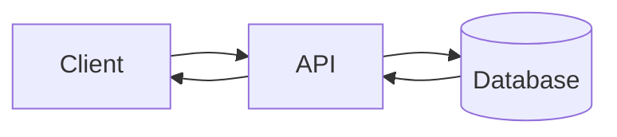
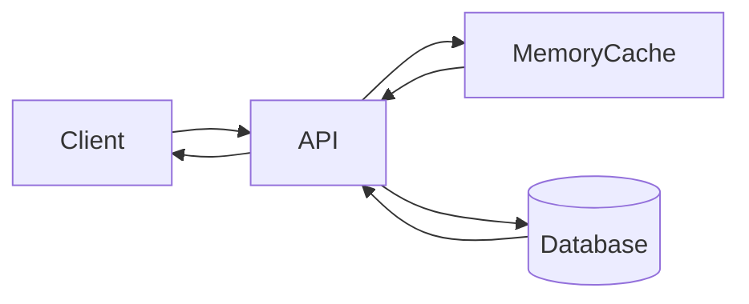

# Memory cache in .NET

API flow without cache

A client want to know city population, it takes a lots of time because wating the database.
Increase perf by using cache

API flow with cache

Because we get the data from the cache, data is not always newest as in the database.
Data in the cache should be remove if they are not used, or renewed after a time.

### Expiration time

Absolute: after a time, remove the data in the cache

Sibling: in a time if you get the data then the lifetime will be extened, if in a time you don't use data, it will be removed