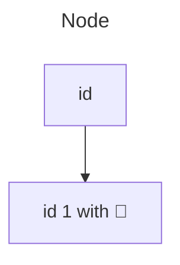
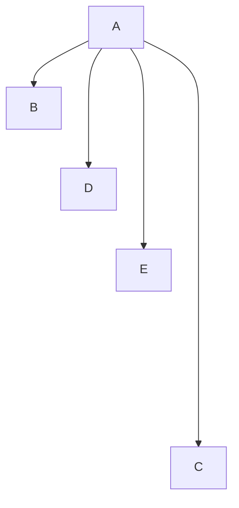

# Flowcharts Basic Syntax

Flowcharts = nodes (gemetric shapes) + edges (arrows or lines)


## A node (with text) 

Use double quotes, backticks

## Directions

Possible orientations are: TB, TD, BT, RL, LR

## Node Shapes
:::mermaid
flowchart TD
    n0(Round node) -->
    n1([Pill node]) -->
    n2[[Subroutine node]] -->
    n3[(Database node)] -->
    n4((Circle node))
:::

:::mermaid
flowchart
    n5>Label node]
    n6[/Parallelogram/] -->
    n7[\Parallelogram\] -->
    n8[\Tapezoid/] -->
    n9[/Tapezoid\] -->
    n10(((Double circle)))
:::

## Expanded Node Shaptes

Use `<node name> @{ shape: <shape>, label: "<label text>" }`

Example:

:::mermaid
flowchart
    D@{ shape: doc, label: "Document" }
    A@{ icon: "logos:archlinux", form: "square", h: 60 }
    R@{ icon: "mdi:ab-testing", form: "square", h: 60 }
:::

## Links

- Arrow `-->`, `-- <text> -->`
- Link `---`, `-- <text> ---`
- Dotted `-.->`, `-. text .->`
- Thick `==>`, `== text ==>`
- Invisible `~~~`

## Animation

First need to define id for link(edge). Example;


## Link length

Long links use multiple `-`.



## Subgraph

```
subgraph <title>
    <graph definition>
end
```