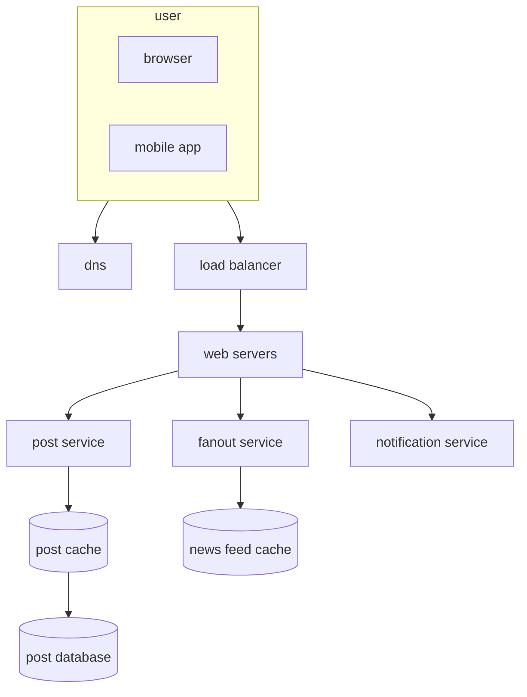

```mermaid
flowchart LR
```

# Full

```mermaid
flowchart

subgraph user
    browser
    app[mobile app]
end

dns
lb[load balancer]
servers[web servers]
posts[post service]
postcache[(post cache)]
postdb[(post database)]
fanouts[fanout service]
newsfeedcache[(news feed cache)]
notifications[notification service]

user --> dns & lb
lb --> servers
servers --> posts & fanouts & notifications
posts --> postcache --> postdb
fanouts --> newsfeedcache
```

